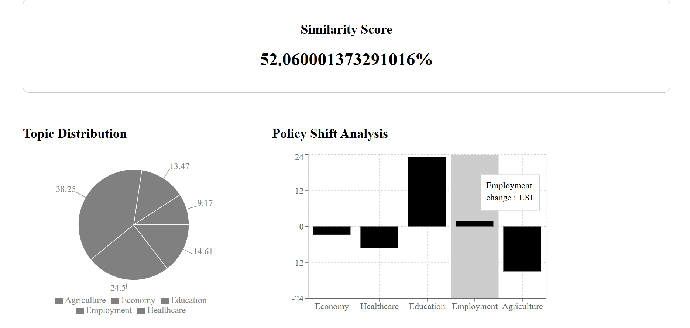
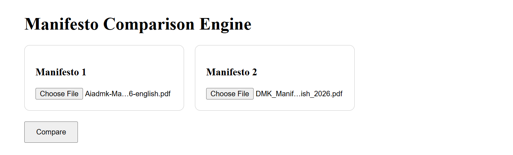

# 🏛️ Manifesto Comparison Engine

An AI-powered platform for analyzing and comparing political manifestos using Natural Language Processing (NLP), semantic similarity, and policy shift detection.

The application enables users to upload manifesto documents, compare their policy focus areas, identify changes in priorities across elections, and visualize manifesto trends through an interactive dashboard.

---

## 🚀 Features

### 📄 PDF Manifesto Analysis

* Upload and process political manifesto PDFs
* Automatic text extraction and preprocessing
* Word count and document statistics

### 🧠 Semantic Similarity Analysis

* Compare manifestos using Sentence Transformers
* Generate semantic similarity scores using cosine similarity
* Detect overlap in policy priorities and themes

### 📊 Topic Distribution Analysis

* Categorize manifesto content into:

  * Economy
  * Healthcare
  * Education
  * Employment
  * Agriculture
* Visualize topic-wise emphasis using interactive charts

### 🔄 Policy Shift Detection

* Compare policy focus between two manifestos
* Identify increases and decreases in topic emphasis
* Track changes in political priorities across election cycles

### 🌐 Interactive Dashboard

* React-based frontend
* Upload and compare manifesto documents
* Dynamic visualizations using Recharts
* Real-time analysis results

---

## 🏗️ System Architecture

PDF Upload
↓
Text Extraction
↓
Text Preprocessing
↓
Topic Classification
↓
Semantic Embedding Generation
↓
Cosine Similarity Analysis
↓
Policy Shift Detection
↓
Interactive Dashboard

---

## 🛠️ Tech Stack

### Frontend

* React
* Axios
* Recharts
* Vite

### Backend

* FastAPI
* Python

### NLP & Machine Learning

* Sentence Transformers
* Scikit-learn
* NumPy

### Document Processing

* PyPDF

---

## 📂 Project Structure

manifesto-comparison-engine/

├── app.py
├── requirements.txt
├── services/
│   ├── pdf_parser.py
│   ├── preprocess.py
│   ├── similarity.py
│   ├── topic_classifier.py
│   └── policy_shift.py
│
├── data/
├── uploads/
│
└── frontend/
├── src/
├── public/
└── package.json

---

## ⚡ Installation

### Backend

```bash
pip install -r requirements.txt
uvicorn app:app --reload
```

Backend runs on:

```text
http://127.0.0.1:8000
```

### Frontend

```bash
cd frontend
npm install
npm run dev
```

Frontend runs on:

```text
http://localhost:5173
```

---

## 📸 Screenshots

### Dashboard



### Upload Page
  

---

## 🎯 Future Enhancements

* AI-generated manifesto summaries
* Transformer-based topic classification
* Historical manifesto trend tracking
* Multi-party comparison support
* LLM-powered policy question answering
* Election-wise manifesto analytics

---

## 👨‍💻 Author

Developed as a full-stack NLP project to analyze political manifestos through semantic document comparison, policy trend analysis, and interactive data visualization.
